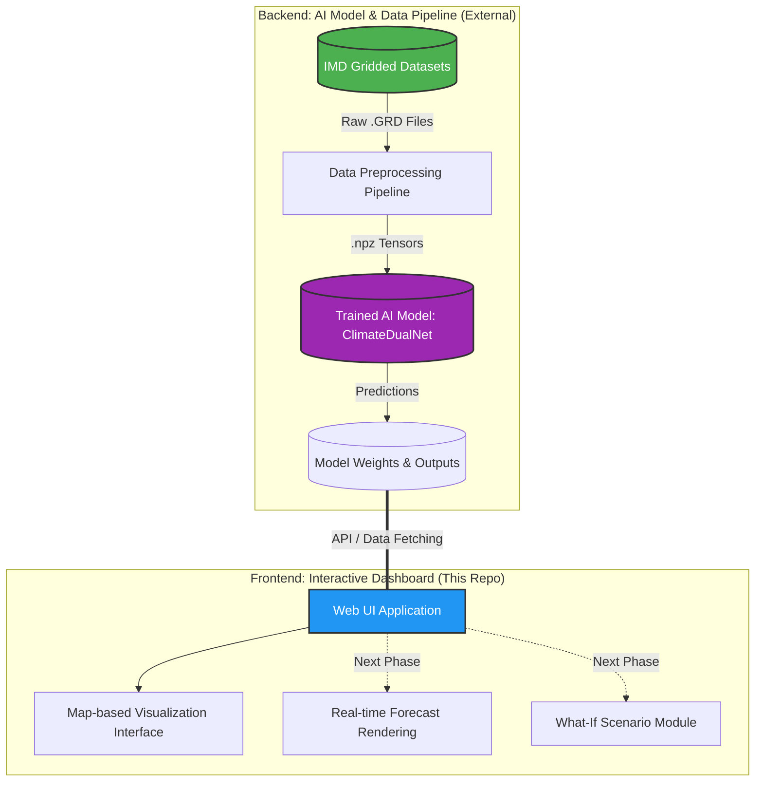

# 🌏 AI-Powered Digital Twin of India's Climate: Interactive Dashboard

## 📌 Overview

This repository hosts the **Interactive Dashboard UI** for the **AI-Powered Digital Twin of India's Climate** project. 

The Digital Twin is designed as a hybrid, multi-branch deep learning model to forecast climate extremes and variations. Because modern AI solutions require specialized environments for data preprocessing, model training, and user interaction, this project adopts a decoupled, modular architecture:

1. **The Data Pipeline** (hosted elsewhere) parses and standardizes official IMD gridded datasets.
2. **The Deep Learning Model** (`ClimateDualNet`, trained and stored elsewhere) generates the forecasts.
3. **This UI Repository** serves as the **Forecast Presentation and Visualization Layer**, allowing end-users to interactively explore the model's predictions over a geographical map.

**Live UI Prototype:** [https://digitaltwin-in.vercel.app/](https://digitaltwin-in.vercel.app/)

## 🎯 Purpose of this UI

A predictive AI model is only as useful as its outputs are accessible. This UI was built to act as the direct user-facing forecast interface. While the underlying AI model outputs complex spatiotemporal tensors representing multi-day forecasts for rainfall and temperatures, this dashboard translates those tensors into a human-readable, map-based visual format.

Currently focused on the pilot region of Kerala and the southern peninsula, the interface maps out high-resolution (0.25° × 0.25°) gridded fields for:
- 🌧 **Rainfall**
- 🌡 **Maximum Temperature (Tmax)**
- 🌡 **Minimum Temperature (Tmin)**

## 🏗️ System Architecture

The following diagram illustrates how the Interactive UI connects with the broader Digital Twin ecosystem:

## 🚀 Current Implementation Status (Phase 1)

**Phase 1 (Completed)** focused on proving the feasibility of the core AI architecture (`ClimateDualNet`) and establishing the data pipeline. 

**UI Status in Phase 1:**
- ✅ Developed and deployed the UI prototype to Vercel.
- ✅ Implemented the map-based interface for visualizing gridded rainfall and temperature fields across the Kerala pilot domain.
- ✅ Established the decoupled architecture, ensuring the UI can operate independently from the heavy model-training infrastructure.

## 🔮 Future Work (Phase 2 Roadmap)

The next phase will heavily enhance the capabilities of this dashboard, transforming it from a visualization prototype into a fully integrated predictive tool:

- **Model Integration:** Directly linking the UI to the live outputs of the Phase 2 multi-branch model (which will include physics-informed and hierarchical-trend branches).
- **Real-Time Forecast Rendering:** Dynamic loading and animation of 7-day forecast horizons directly on the map.
- **Explainable AI (XAI) Overlays:** Visualizing SHAP and Grad-CAM outputs to explain *why* the model is predicting specific extreme events.
- **"What-If" Scenario Simulation:** An interactive module allowing users to tweak climate variables and instantly see the simulated impact on local weather patterns, leveraging the underlying model's fusion layer.

## 🔗 Project Ecosystem Links

To explore the full scope of the Digital Twin project, please refer to the following resources:

| Component | Resource Link |
|-----------|--------------|
| **UI Dashboard (Live Prototype)** | [digitaltwin-in.vercel.app](https://digitaltwin-in.vercel.app/) |
| **UI Source Code** | [github.com/anasalam-xyz/digital-twin](https://github.com/anasalam-xyz/digital-twin) |
| **Data Preprocessing Pipeline** | [github.com/aditya-raj9125/Digital-Twin](https://github.com/aditya-raj9125/Digital-Twin/tree/main) |
| **Model Training Notebook** | [Google Colab](https://colab.research.google.com/drive/1mf-kjpPhyaed0wkHWKu9GKIkK4DFwS6H?usp=sharing) |
| **Checkpoints & Diagnostic Plots** | [Google Drive Folder](https://drive.google.com/drive/folders/1efm85dzpRnf6ufU3qKhlyTZWFP1JGwMd?usp=sharing) |
| **Detailed Architecture Document** | [Google Docs](https://docs.google.com/document/d/1KsxmaGxhuVIss7dc9mCIEOfIbnENyrDp60bkAkGDPnI/edit?usp=sharing) |

---
*Developed as part of the AI-Powered Digital Twin of India's Climate Project. Demonstrating technical feasibility, transparent engineering, and actionable climate insights.*
